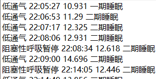
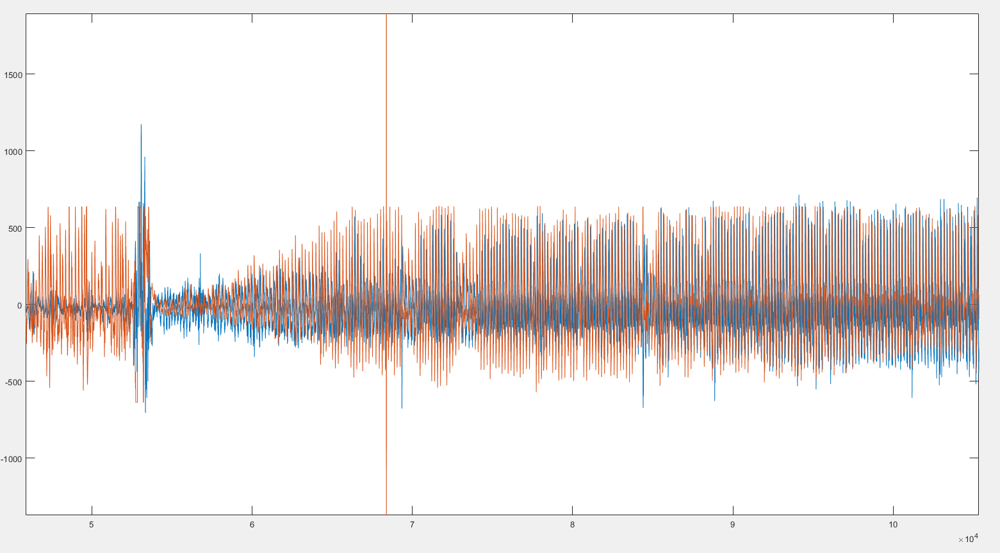
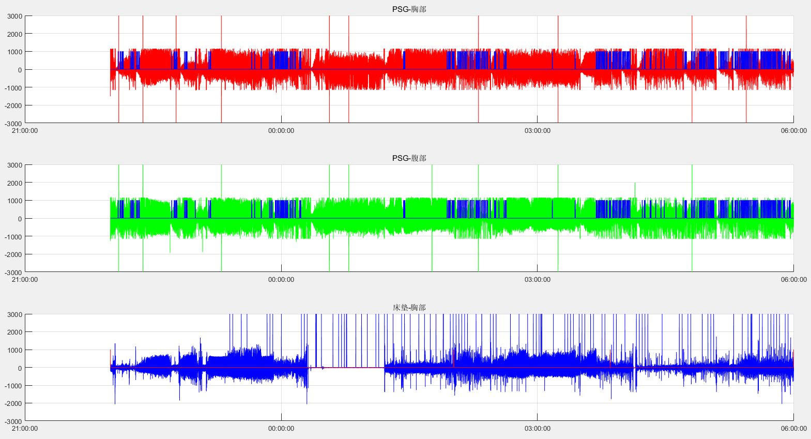
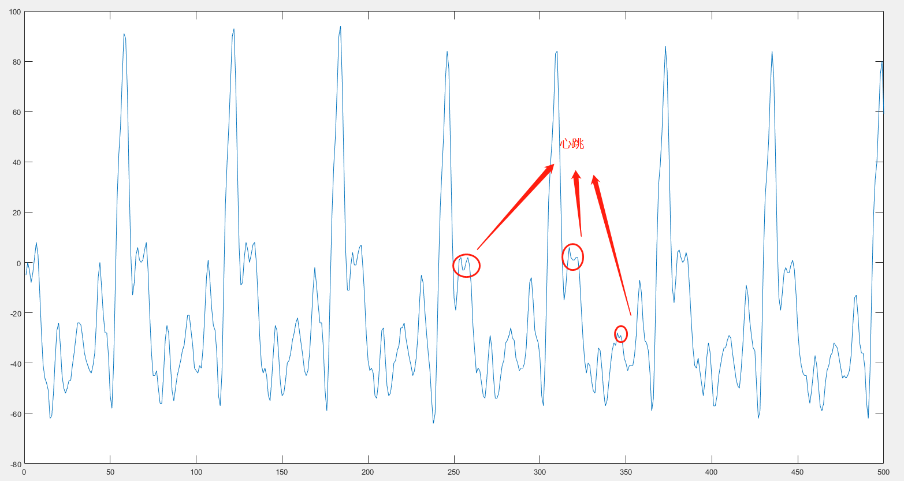
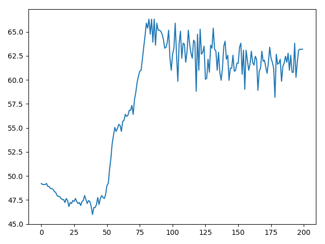
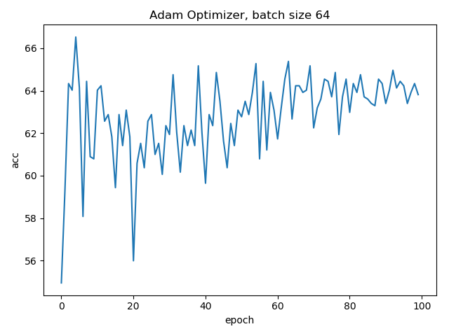

# 2019-03-12
该报告主要是对目前的实验进展进行总结和讨论

## 实验部分
本部分主要报告论文相关的实验进展。

实验大致分为以下几部分：

- 数据集的制作
- 数据预处理
- 卷积神经网络模型的设计
- 目前模型的性能
- 总结与讨论

### 数据集的制作
#### 数据集的准备
目前我手头的数据来自跃扬公司在周浦医院采集的14位受测者（其中11个有效）PSG数据和同时通过智能床垫采集的原始信号数据（床垫数据）。

PSG数据的信号格式为：

- 胸廓带电极信号：32hz
- 腹部信号：32hz

床垫数据：

- 18路50hz的原始数据。一般转换为2路50hz的头部信号和胸部信号，甚至转化为更高级的信号（例如呼吸波形，BCG波形）

呼吸暂停事件：

由PSG导出的呼吸暂停事件txt文件。每个呼吸暂停事件被描述为`呼吸暂停类别`，`发生时间`，`持续时间（秒）`，`睡眠时期`
*PSG机器自动标注，没有进行人工复核修改*

由于两个设备在采集时是独立进行的，因此在进行实验之前首先需要对数据进行对齐处理，使两种数据的起始时间一致，持续时间一致。

数据对齐后，通过PSG导出的呼吸暂停事件文件，可以同时对床垫数据进行呼吸暂停事件标注。：

对齐后对比

至此，数据集制作的必要条件已经完成。

#### 数据集信号的选择
在跃扬，床垫数据从低层次往高层次划分可以分为：

- 第一层：原始数据：18路50hz数据
- 第二层：整合后的原始数据：头部、胸部两路50hz的数据
- 第三层：呼吸波，BCG波：5hz的数据

理论上来说，数据集可以采用任意一层的数据作为样本，这里我暂时选择了**第二层：胸部50hz的数据**

#### 数据集的制作
**胸部50hz数据**形状是一个`[1 * 时间长度*采样频率]`的一维时间序列数据

我将呼吸暂停事件的信息导入，转化成了与**胸部50hz数据**形状相同的行向量。用1表示呼吸暂停，0表示非呼吸暂停

同时，我使用跃扬现有的体动状态计算方法，得到了每秒的**体动状态**并转化成了与**胸部50hz数据**形状相同的行向量。
体动状态共有`离床`，`静卧`，`体动`三个状态，在程序中用int型的数字表示

通过阅读了一些参考文献，一些学者将每个样本的长度定位**10秒**效果比较好，因此本次实验我也将样本长度定位**10秒**每个

我将完整的数据，分割成了若干个**10秒**的片段，信号的采样频率是**50hz**，因此每个片段是一个`[1*500]`的行向量，
包含**胸部数据**，**体动状态**，**呼吸暂停**信息。

**标注依据**

目前我的标注依据是。对于每个片段，如果超过**8秒**处于**静卧**那么该样本视为**有效样本**，
接下来对于每个**有效样本**，如果超高**8秒**处于**呼吸暂停**，则该样本标注为**呼吸暂停样本**，否则标注为**正常样本**

我将这些样本以存入了`train.csv`和`test.csv`文件中，其中训练集包含`3808`个样本，测试集包含`960`个样本。正负样本数量均匀，训练集数据占`80%`，测试集数据占`20%`

### 数据预处理
目前没有做太多的预处理。根据一篇参考文献，我把每个样本的采样频率从50hz提升到200hz

如果可以，我可以考虑在数据上加上一个滤波器，让数据看上去**更光滑**

### 卷积神经网络模型的设计
我的模型是参考一篇基于ECG信号进行呼吸暂停检测的文章实现的，该文章提出了下图的模型：

该模型可以概括为：

**输入**：10秒200hz的一维数据信号

**过程**：输入 ==> 批处理层 ==> 6个卷积层 ==> 2个全连接层 ==> softmax函数 ==> 分类结果

其中，该模型使用的`损失函数`是`交叉熵损失函数`，每个卷积层中使用`ReLU`激活函数以及`1*2的最大值池化层`，并在第二层卷积层开始加入`dropout`层，
使用Adam优化器

在实际实验过程中我发现，参考模型对于我的数据集效果并没有很理想，因此我稍微的修改了一下模型

输入不变，我将批处理层放到了每个卷积层中，同时尝试了一下SGD优化器

### 目前的模型的性能
当前实验中，我们将分类结果划为以下四种情况：

- TP：标注为呼吸暂停，预测为呼吸暂停
- TN：标注为正常，预测为正常
- FP：标注为正常，预测为呼吸暂停
- FN：标注为呼吸暂停，预测为正常

根据参考文献，二分类问题模型的评价指标通常分为：

- accuracy(准确率): 对所有样本预测正确的比率
- precision(精确率)： 预测为呼吸暂停的样本，有多少是预测正确的
- recall(召回率): 对于所有呼吸暂停样本，有多少被成功预测
- F1-scroe（F1得分率）：综合考虑精确率和召回率的调和均值（综合评价）

结合呼吸暂停场景，还可以根据预测结果，倒推模型对于哪类呼吸暂停预测的效果比较好

**目前模型的性能**

目前还处于一个初期阶段，我仅计算了准确率

**基于SGD分类器的准确率：**

**基于Adam分类器:**

### 总结与讨论

目前最高的准确率大约在67.5%左右，还没达到一个可以使用的水平。

为了提高模型的性能，可以从以下几个方面尝试改进：
1. 使用其他输入信号
2. 修改损失函数、优化器
3. 修改模型
4. 考虑从表现较好的角度来评价模型

为了更好的衡量每次修改的效果，应该尽快将评价指标在每次训练后都计算出来

## 论文部分
### 大论文的框架

**题目：非接触式呼吸暂停检测算法的研究与实现**

**摘要**

- 1 绪论
	- 1.1 课题研究背景（研究的目的与意义）
	- 1.2 国内外研究现状
		- 1.2.1 呼吸暂停算法的相关研究现状
		- 1.2.2 非接触式智能床垫的相关研究现状
	- 1.3 课题研究内容
		- 1.3.1 主要技术难点
		- 1.3.2 研究内容
	- 1.4 论文组织安排
- 2 相关背景知识介绍（相关工作综述）
	- *2.1 基于压电陶瓷传感器获取生命体征*
	- 2.2 机器学习的背景介绍
	- 2.3 深度学习的简介
		- 2.2.1 神经元
		- 2.2.2 激活函数
		- 2.2.3 损失函数
		- 2.2.4 优化器
	- 2.4卷积神经网络
		- 2.4.1 卷积神经网络的结构
		- 2.4.2 卷积神经网络的特性
		- 2.4.3 一维卷积神经网络
	- 2.5 *一些其他的深度学习方法，例如LSTM,RNN*
- 3 呼吸暂停检测算法的实现
	- 3.1 数据集
	- 3.2 数据预处理
	- 3.3 基于一维卷积神经网络的模型搭建
	- 3.4 分类器与损失函数的选择
	- 3.5 模型的评价指标
	- 3.6 结果分析与讨论
- *4 非接触式呼吸暂停识别系统的搭建*
- 5 总结与展望
	
### 大小论文时间点的确认